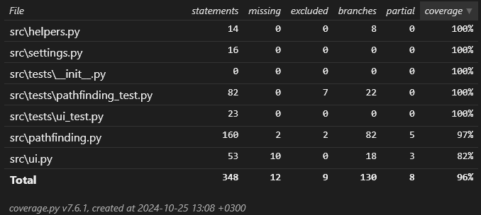

# Testausdokumentti

## Yksikkötestaus

Yksikkötesteissä on käytetty unnittest-kirjastoa.

### Testikattavuus



Tavoitteena on 100% testikattavuus.

### Testien ajaminen

Voit ajaa testit seuraavalla komennolla projektin juurihakemistossa:
```bash
poetry run invoke coverage-report
```
se generoi testikattavuusraportin, joka löytyy `htmlcov/index.html`

<!---
TODO 
- Mitä on testattu, miten tämä tehtiin
- Minkälaisilla syötteillä testaus tehtiin
-->


WIP